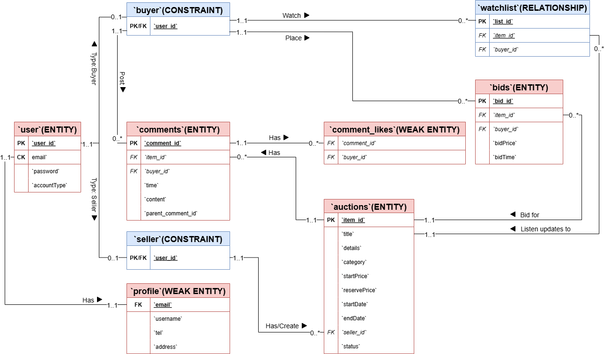

# Requirement Ticklists:

- Users can 
  - register with the system 
  - and create accounts. 
- Users have roles of seller or buyer with different privileges. 
- Sellers can 
  - create auctions for particular items, 
  - setting suitable conditions and features of the items including the item description, categorisation, starting price, reserve price and end date. 
- Buyers can 
  - search the system for particular kinds of item being auctioned and can 
  - browse and visually re-arrange listings of items within categories. 
- Buyers can bid for items and see the bids other users make as they are received. The system will manage the auction until the set end time and award the item to the highest bidder. The system should confirm to both the winner and seller of an auction its outcome. 
- Extra functionality related to core features requiring usage of a database.
- Buyers can 
  - watch auctions on items and 
  - receive emailed updates on bids on those items including notifications when they are outbid.
- Buyers can 
  - receive recommendations for items to bid on based on collaborative filtering (i.e., ‘you might want to bid on the sorts of things other people, who have also bid on the sorts of things you have previously bid on, are currently bidding on). 


# Database Project Group 4 Report 

- URL for your Youtube video
- Your ERD, giving any assumptions that it makes about the processes that uses the data.
- A listing of your database schema (list of table names and attributes) with an explanatic of how it translates the ER diagram
- An analsis showing that the database schema is in third normal form.
- A listing and explanation of your database queries
- Other individual submission: 1) a self-assessment 2) peer assessment

## Youtube Link for Demo Video:

## ER Diagram and Assumptions

### ER Diagram



### Assumptions:
- User Roles: Users can be either buyers or sellers, but not both simultaneously.
- Profile Information: Each user has a profile containing their contact information.
- Auctions: Sellers create auctions, and buyers can add items to their watchlist or place bids.
- Comments and Likes: Buyers can comment on auction items and like comments

## Schema Listing and Analysis of 3rd Normal Form:

### User Table
| Attribute    | Data Type         | Note                | Definition                     |
|--------------|-------------------|---------------------|--------------------------------|
| `user_id`    | INT               | PK                  | User ID                        |
| `password`   | VARCHAR(100)      |                      | User password                  |
| `email`      | VARCHAR(100)      | Candidate Key UNIQUE| User email                     |
| `accountType`| ENUM('buyer', 'seller') | NOT NULL      | Type of account (buyer/seller) |

**Functional Dependencies**:
- `user_id` → `password`, `email`, `accountType`
- `email` → `user_id`, `password`, `accountType`

**Analysis**:
- **1NF**: Each attribute contains atomic values.
- **2NF**: All non-key attributes (`password`, `email`, `accountType`) are fully dependent on the primary key (`user_id`).
- **3NF**: There are no transitive dependencies. Each non-key attribute is directly dependent on the primary key.

### Profile Table
| Attribute    | Data Type         | Note                | Definition                     |
|--------------|-------------------|---------------------|--------------------------------|
| `user_id`    | INT               | PK, FK              | User ID                        |
| `username`   | VARCHAR(50)       |                     | Username                       |
| `tel`        | VARCHAR(15)       |                     | Telephone number               |
| `address`    | VARCHAR(100)      |                     | Address                        |

**Functional Dependencies**:
- `user_id` → `username`, `tel`, `address`

**Analysis**:
- **1NF**: Each attribute contains atomic values.
- **2NF**: All non-key attributes (`username`, `tel`, `address`) are fully dependent on the primary key (`user_id`).
- **3NF**: There are no transitive dependencies. Each non-key attribute is directly dependent on the primary key.

### Buyer Table
| Attribute    | Data Type         | Note                | Definition                     |
|--------------|-------------------|---------------------|--------------------------------|
| `user_id`    | INT               | PK, FK              | User ID                        |

**Functional Dependencies**:
- `user_id` → `user_id`

**Analysis**:
- **1NF**: Each attribute contains atomic values.
- **2NF**: Fully dependent on the primary key (`user_id`).
- **3NF**: No transitive dependencies.

### Seller Table
| Attribute    | Data Type         | Note                | Definition                     |
|--------------|-------------------|---------------------|--------------------------------|
| `user_id`    | INT               | PK, FK              | User ID                        |

**Functional Dependencies**:
- `user_id` → `user_id`

**Analysis**:
- **1NF**: Each attribute contains atomic values.
- **2NF**: Fully dependent on the primary key (`user_id`).
- **3NF**: No transitive dependencies.

### Auctions Table
| Attribute      | Data Type         | Note                | Definition                     |
|----------------|-------------------|---------------------|--------------------------------|
| `item_id`      | INT               | PK                  | Item ID                        |
| `title`        | VARCHAR(50)       | CK                  | Auction title                  |
| `details`      | TEXT              |                     | Auction details                |
| `category`     | VARCHAR(30)       |                     | Auction category               |
| `startPrice`   | DECIMAL(10, 2)    |                     | Starting price                 |
| `reservePrice` | DECIMAL(10, 2)    |                     | Reserve price                  |
| `startDate`    | DATETIME          |                     | Auction start date             |
| `endDate`      | DATETIME          |                     | Auction end date               |
| `seller_id`    | INT               | FK                  | Seller ID                      |
| `status`       | ENUM('active', 'closed', 'cancelled') | NOT NULL | Auction status        |

**Functional Dependencies**:
- `item_id` → `title`, `details`, `category`, `startPrice`, `reservePrice`, `startDate`, `endDate`, `seller_id`, `status`

**Analysis**:
- **1NF**: Each attribute contains atomic values.
- **2NF**: All non-key attributes are fully dependent on the primary key (`item_id`).
- **3NF**: No transitive dependencies. Each non-key attribute is directly dependent on the primary key.

### Watchlist Table
| Attribute    | Data Type         | Note                | Definition                     |
|--------------|-------------------|---------------------|--------------------------------|
| `list_id`    | INT               | PK                  | ID for each pair of buyer and item |
| `buyer_id`   | INT               | FK                  | Buyer ID                       |
| `item_id`    | INT               | FK                  | Item ID                        |

**Functional Dependencies**:
- `list_id` → `buyer_id`, `item_id`

**Analysis**:
- **1NF**: Each attribute contains atomic values.
- **2NF**: All non-key attributes are fully dependent on the primary key (`list_id`).
- **3NF**: No transitive dependencies. Each non-key attribute is directly dependent on the primary key.

### Bids Table
| Attribute    | Data Type         | Note                | Definition                     |
|--------------|-------------------|---------------------|--------------------------------|
| `bid_id`     | INT               | PK                  | Bid ID                         |
| `buyer_id`   | INT               | FK                  | Buyer ID                       |
| `item_id`    | INT               | FK                  | Item ID                        |
| `bidPrice`   | DECIMAL(10, 2)    |                     | Bid price                      |
| `bidTime`    | DATETIME          |                     | Bid time                       |

**Functional Dependencies**:
- `bid_id` → `buyer_id`, `item_id`, `bidPrice`, `bidTime`

**Analysis**:
- **1NF**: Each attribute contains atomic values.
- **2NF**: All non-key attributes are fully dependent on the primary key (`bid_id`).
- **3NF**: No transitive dependencies. Each non-key attribute is directly dependent on the primary key.

### Comments Table
| Attribute          | Data Type         | Note                | Definition                     |
|--------------------|-------------------|---------------------|--------------------------------|
| `comment_id`       | INT               | PK                  | Comment ID                     |
| `item_id`          | INT               | FK                  | Item ID                        |
| `buyer_id`         | INT               | FK                  | Buyer ID                       |
| `time`             | DATETIME          |                     | Comment time                   |
| `content`          | VARCHAR(1023)     |                     | Comment content                |
| `parent_comment_id`| INT               | FK                  | Parent comment ID              |

**Functional Dependencies**:
- `comment_id` → `item_id`, `buyer_id`, `time`, `content`, `parent_comment_id`

**Analysis**:
- **1NF**: Each attribute contains atomic values.
- **2NF**: All non-key attributes are fully dependent on the primary key (`comment_id`).
- **3NF**: No transitive dependencies. Each non-key attribute is directly dependent on the primary key.

### Comment_likes Table
| Attribute    | Data Type         | Note                | Definition                     |
|--------------|-------------------|---------------------|--------------------------------|
| `comment_id` | INT               | FK                  | Comment ID                     |
| `buyer_id`   | INT               | FK                  | Buyer ID                       |

**Functional Dependencies**:
- (`comment_id`, `buyer_id`) → `comment_id`, `buyer_id`

**Analysis**:
- **1NF**: Each attribute contains atomic values.
- **2NF**: Fully dependent on the composite primary key (`comment_id`, `buyer_id`).
- **3NF**: No transitive dependencies.

In conclusion, all tables in the schema meet the criteria for 1NF, 2NF, and 3NF. Therefore, the database schema is in Third Normal Form (3NF). This ensures that the schema is free of redundancy and maintains data integrity.

## All SQL Query Listings Sorted by PHP Files:

### Main page Related
**MAIN FUNCTIONS:** 
   - **For browse, mylistings, mybids, mywatchlist: collaborate with search bar form input to show items in customized ways**
   - **For listing, show the item information, comment and current user's bid history of corresponding items if user logged in as buyer**

#### browse.php

1. **Constructing the Main Query**:
    ```php
    $sql = "SELECT * FROM auctions";
    ```

    - **Purpose**: This initializes the SQL query to select all columns from the `auctions` table.

2. **Adding Conditions Based on User Input**:
    ```php
    if (isset($_GET['keyword']) || $keyword != "") {
        $sql .= " WHERE (title LIKE '%$keyword%' OR details LIKE '%$keyword%')";
        if ($category != "") {
            if ($search_type == "union") {
                $sql .= " UNION SELECT * FROM auctions WHERE category = '$category'";
            } else {
                $sql .= " AND category = '$category'";
            }
        }
    } else if ($category != "") {
        $sql .= " WHERE category = '$category'";
    }
    if ($ordering != "") {
        $sql .= " ORDER BY $ordering";
    }
    ```

    - **Purpose**: This section dynamically modifies the SQL query based on user input from the URL parameters.
    - **Conditions**:
        - If a `keyword` is provided, it adds a `WHERE` clause to search for the keyword in the `title` or `details` columns.
        - If a `category` is provided, it adds a condition to filter by the specified category.
        - If `search_type` is `union`, it uses a `UNION` to combine results from the keyword search and category filter.
        - If an `ordering` parameter is provided, it adds an `ORDER BY` clause to sort the results.

3. **Executing the Main Query**:
    ```php
    $result_q = mysqli_query($con, $sql);
    ```

    - **Purpose**: This executes the constructed SQL query and stores the result in `$result_q`.

4. **Pagination**:
    ```php
    $num_results = mysqli_num_rows($result_q);
    $results_per_page = 10;
    $max_page = ceil($num_results / $results_per_page);
    ```

    - **Purpose**: This calculates the total number of results and determines the number of pages needed for pagination.

5. **Limiting Results for Current Page**:
    ```php
    if ($curr_page != "") {
        $sql .= " LIMIT " . (($curr_page - 1) * $results_per_page) . ", $results_per_page";
    }
    $result_q = mysqli_query($con, $sql);
    ```

    - **Purpose**: This modifies the SQL query to limit the results to the current page based on the pagination settings and re-executes the query.

6. **Fetching Auction Details**:
    ```php
    while ($fetch = mysqli_fetch_array($result_q)) {
        $item_id = $fetch['item_id'];
        $title = $fetch['title'];
        $description = $fetch['details'];
        // sql search for newest price and number of bids
        $bid_sql = "SELECT bidPrice FROM bids WHERE item_id = $item_id ORDER BY bidPrice DESC";
        $bid_result = mysqli_query($con, $bid_sql);
        $num_bids = mysqli_num_rows($bid_result);
        if ($num_bids > 0) {
            $current_price = mysqli_fetch_array($bid_result)[0];
        } else {
            $current_price = $fetch['startPrice'];
        }
        $end_date = $fetch['endDate'];
        print_listing_li($item_id, $title, $description, $current_price, $num_bids, $end_date);
    }
    ```

    - **Purpose**: This loop fetches each auction listing and retrieves the latest bid price and number of bids for each item.
    - **Bid Query**:
        ```php
        $bid_sql = "SELECT bidPrice FROM bids WHERE item_id = $item_id ORDER BY bidPrice DESC";
        ```
        - **Purpose**: This query selects the highest bid price for the current item from the `bids` table.

These SQL statements handle the core functionalities of searching, filtering, and paginating auction listings, as well as retrieving bid information for each listing.


#### listing.php

1. **Retrieving Auction Details**:
    ```php
    $sql = "SELECT * FROM auctions WHERE item_id = '$item_id';";
    $result = mysqli_query($con, $sql);
    $fetch = mysqli_fetch_array($result);
    ```
    - **Purpose**: This SQL statement retrieves all details of the auction item from the `auctions` table.
    - **Parameters**:
        - `item_id`: The ID of the auction item.

2. **Retrieving Bid Prices**:
    ```php
    $bid_sql = "SELECT bidPrice FROM bids WHERE item_id = $item_id ORDER BY bidPrice DESC";
    $bid_result = mysqli_query($con, $bid_sql);
    ```
    - **Purpose**: This SQL statement retrieves all bid prices for the auction item, ordered by the highest bid first, from the `bids` table.
    - **Parameters**:
        - `item_id`: The ID of the auction item.

3. **Checking if User is Watching the Item**:
    ```php
    $sql = "SELECT buyer_id, item_id FROM watchlist WHERE buyer_id = '$user_id' AND item_id = '$item_id'";
    $result = mysqli_query($con, $sql);
    ```
    - **Purpose**: This SQL statement checks if the user is watching the auction item by looking for a record in the `watchlist` table.
    - **Parameters**:
        - `buyer_id`: The ID of the user.
        - `item_id`: The ID of the auction item.

These SQL statements handle the core functionalities of retrieving auction details, bid prices, and checking if the user is watching the auction item.

4. **Removing from Watchlist**:
    ```php
    $sql = "SELECT buyer_id, item_id FROM watchlist WHERE buyer_id = '$user_id' AND item_id = '$item_id'";
    $result = mysqli_query($con, $sql);
    ```
    - **Purpose**: This SQL statement checks if the user is watching the auction item by looking for a record in the `watchlist` table.
    - **Parameters**:
        - `buyer_id`: The ID of the user.
        - `item_id`: The ID of the auction item.

5. **Retrieving Bidding History**:
    ```php
    $sql = "SELECT auctions.item_id, auctions.title, auctions.details, auctions.endDate, auctions.status, b.bidTime, b.bidPrice 
            FROM (SELECT item_id, bidTime, bidPrice FROM bids WHERE bids.item_id = $item_id) as b
            INNER JOIN auctions
            ON b.item_id = auctions.item_id
            ORDER BY bidPrice DESC";
    $result = mysqli_query($con, $sql);
    ```
    - **Purpose**: This SQL statement retrieves the bidding history for the auction item, including details such as bid time and bid price, from the `bids` and `auctions` tables.
    - **Parameters**:
        - `item_id`: The ID of the auction item.

6. **Pagination for Bidding History**:
    ```php
    $sql .= " LIMIT " . (($curr_page - 1) * $results_per_page) . ", $results_per_page";
    $result = mysqli_query($con, $sql);
    ```
    - **Purpose**: This SQL statement limits the results for the bidding history to the current page based on the pagination settings.
    - **Parameters**:
        - `curr_page`: The current page number.
        - `results_per_page`: The number of results to display per page.

These SQL statements handle the core functionalities of removing an item from the watchlist, retrieving bidding history, and implementing pagination for the bidding history.

7. **Retrieving Comments for the Auction**:
    ```php
    $comments_sql = "SELECT c.comment_id, c.buyer_id, c.time, c.content, u.username, c.parent_comment_id
                     FROM user
                     JOIN comments c ON user.user_id = c.buyer_id
                     JOIN profile u ON user.email = u.email
                     WHERE c.item_id = $item_id
                     ORDER BY c.time ASC";
    $comments_result = mysqli_query($con, $comments_sql);
    ```
    - **Purpose**: This SQL statement retrieves all comments for the auction item, including the comment ID, buyer ID, time, content, username, and parent comment ID, ordered by time in ascending order.
    - **Parameters**:
        - `item_id`: The ID of the auction item.

8. **Counting Likes for Each Comment**:
    ```php
    $likes_sql = 'SELECT COUNT(*) AS likes FROM comment_likes WHERE comment_id = ' . $comment['comment_id'];
    $likes_result = mysqli_query($con, $likes_sql);
    ```
    - **Purpose**: This SQL statement counts the number of likes for each comment.
    - **Parameters**:
        - `comment_id`: The ID of the comment.

These SQL statements handle the core functionalities of retrieving comments for the auction item and counting the number of likes for each comment.


### Account Management Related 
**FILES:**
**MAIN FUNCTIONS: register, login, edit peronal profile, change password, send verification code**

#### process_registration.php

1. **Checking if Email is Already Registered**:
    ```php
    $sql = "SELECT * FROM user WHERE email = '$email' AND accountType = '$accountType';";
    $result = $con->query($sql);
    ```
    - **Purpose**: This SQL statement checks if the provided email address is already registered for the specified account type in the `user` table.
    - **Parameters**:
        - `email`: The email address entered by the user.
        - `accountType`: The type of account (e.g., buyer, seller).

2. **Inserting New User Data**:
    ```php
    $sql = "INSERT INTO user (password, email, accountType) VALUES (SHA('$password'),'$email','$accountType');";
    $sql .= "INSERT INTO $accountType SELECT user_id FROM user WHERE email = '$email' AND accountType = '$accountType';";
    $sql .= "INSERT INTO profile (email, username) VALUES ('$email', '$username');";
    if ($con->multi_query($sql)) {
        echo "User data insert succeed.\n";
    } else {
        echo "data insert failed.\n" . "<br/>" . $con->error;
    }
    ```
    - **Purpose**: These SQL statements insert new user data into the `user`, `accountType`, and `profile` tables.
    - **Parameters**:
        - `password`: The password entered by the user, hashed using the `SHA` function.
        - `email`: The email address entered by the user.
        - `accountType`: The type of account (e.g., buyer, seller).
        - `username`: A randomly generated username.

These SQL statements handle the core functionalities of checking for existing email addresses and inserting new user data into the database.

#### login_result.php

1. **User Login Query**:
    ```php
    $sql = "SELECT * FROM user WHERE email = '$email' AND password = SHA('$password') AND accountType = '$accountType';";
    $result = mysqli_query($con, $sql);
    ```
    - **Purpose**: This SQL statement checks if a user with the provided email, password, and account type exists in the `user` table.
    - **Parameters**:
        - `email`: The email address entered by the user.
        - `password`: The password entered by the user, hashed using the `SHA` function.
        - `accountType`: The type of account (e.g., buyer, seller) selected by the user.

2. **Profile Query**:
    ```php
    $sql_profile = "SELECT * FROM profile WHERE email = '$email';";
    $result_profile = mysqli_query($con, $sql_profile);
    ```
    - **Purpose**: This SQL statement retrieves the profile information of the user from the `profile` table based on the provided email.
    - **Parameters**:
        - `email`: The email address of the user.

These SQL statements handle the core functionalities of verifying user credentials during login and retrieving the user's profile information.

#### forget_password.php

1. **Checking if User Exists**:
    ```php
    $sql = "SELECT user_id FROM user WHERE email = '$email'";
    $user_record = mysqli_query($con, $sql);
    ```
    - **Purpose**: This SQL statement checks if a user with the provided email exists in the `user` table.
    - **Parameters**:
        - `email`: The email address entered by the user.

2. **Retrieving Username**:
    ```php
    $sql_username = "SELECT username FROM profile WHERE email = '$email';";
    $result_profile = mysqli_query($con, $sql_username);
    ```
    - **Purpose**: This SQL statement retrieves the username associated with the provided email from the `profile` table.
    - **Parameters**:
        - `email`: The email address of the user.

3. **Updating Password**:
    ```php
    $sql_update_password = "UPDATE user SET password = SHA('$new_password') WHERE user_id = $user_id";
    ```
    - **Purpose**: This SQL statement updates the password for the user with the specified `user_id` in the `user` table.
    - **Parameters**:
        - `new_password`: The new password entered by the user, hashed using the `SHA` function.
        - `user_id`: The ID of the user whose password is being updated.

These SQL statements handle the core functionalities of verifying the existence of a user, retrieving the user's username, and updating the user's password.

#### edit_information.php

1. **Retrieving User Profile Information**:
    ```php
    $sql = "SELECT * FROM profile WHERE email = '$email';";
    $result = mysqli_query($con, $sql);
    ```
    - **Purpose**: This SQL statement retrieves the profile information of the user based on their email address from the `profile` table.
    - **Parameters**:
        - `email`: The email address of the user.

This SQL statement handles the core functionality of retrieving the user's profile information to display it on the profile edit page.

#### process_edit.php

1. **Checking for existing email:**
   ```php
   $check_email_sql = "SELECT user_id FROM user WHERE email = '$email' AND user_id != '$user_id' AND accountType = '$accountType'";
   ```
   - **Purpose:** This query checks if the provided email address is already registered to another user with the same account type. If it finds a match, it prevents the email from being used again.

2. **Fetching user profile information before editing:**
   ```php
   $sql_info_before_edit = "SELECT * FROM profile WHERE user_id = '$user_id';";
   ```
   - **Purpose:** This query retrieves the current profile information (telephone and address) of the user before any updates are made. This is used to compare and determine if any changes have been made.

3. **Updating user information:**
   ```php
   $sql_user = "UPDATE user SET ";
   ```
   - **Purpose:** This is the base of the SQL update statement for the `user` table. It will be appended with specific fields to update if there are any changes.

4. **Updating profile information:**
   ```php
   $sql_profile = "UPDATE profile SET ";
   ```
   - **Purpose:** This is the base of the SQL update statement for the `profile` table. It will be appended with specific fields to update if there are any changes.

5. **Executing the update for user table:**
   ```php
   $sql_user .= implode(", ", $updates_user);
   $sql_user .= " WHERE user_id = '$user_id'";
   $result_edit_user = $con->query($sql_user);
   ```
   - **Purpose:** This query updates the `user` table with the new email if it has been changed. It constructs the full SQL statement by appending the changes and executes it.

6. **Executing the update for profile table:**
   ```php
   $sql_profile .= implode(", ", $updates_profile);
   $sql_profile .= " WHERE user_id = '$user_id'";
   $result_edit_profile = $con->query($sql_profile);
   ```
   - **Purpose:** This query updates the `profile` table with the new username, telephone, and address if they have been changed. It constructs the full SQL statement by appending the changes and executes it.

These SQL statements are used to ensure that the user's profile information is correctly updated in the database while checking for any conflicts, such as duplicate email addresses. If no changes are detected, the script informs the user that no updates were made.

#### change_password.php

1. **Checking if User Exists**:
    ```php
    $sql = "SELECT user_id FROM user WHERE email = '$email'";
    $user_record = mysqli_query($con, $sql);
    ```
    - **Purpose**: This SQL statement checks if a user with the provided email exists in the `user` table.
    - **Parameters**:
        - `email`: The email address entered by the user.

2. **Retrieving Username**:
    ```php
    $sql_username = "SELECT username FROM profile WHERE email = '$email';";
    $result_profile = mysqli_query($con, $sql_username);
    ```
    - **Purpose**: This SQL statement retrieves the username associated with the provided email from the `profile` table.
    - **Parameters**:
        - `email`: The email address of the user.

3. **Updating Password**:
    ```php
    $sql_update_password = "UPDATE user SET password = SHA('$new_password') WHERE user_id = $user_id";
    ```
    - **Purpose**: This SQL statement updates the password for the user with the specified `user_id` in the `user` table.
    - **Parameters**:
        - `new_password`: The new password entered by the user, hashed using the `SHA` function.
        - `user_id`: The ID of the user whose password is being updated.

These SQL statements handle the core functionalities of verifying the existence of a user, retrieving the user's username, and updating the user's password.

### Buyer/Bids Related
**MAIN FUNCTIONS: watch, bid for an item, receive outbid or status update notifications of bidded/watching items, get recommendations**

#### place_bid.php

1. **Inserting a New Bid**:
    ```php
    $sql = "INSERT INTO bids (buyer_id, item_id, bidPrice, bidTime) 
            VALUES ($user_id, $item_id, '$bidPrice', '$bidTime');";
    ```
    - **Purpose**: This SQL statement inserts a new bid into the `bids` table.
    - **Parameters**:
        - `buyer_id`: The ID of the buyer making the bid.
        - `item_id`: The ID of the item being bid on.
        - `bidPrice`: The bid amount.
        - `bidTime`: The timestamp of when the bid was made.

2. **Retrieving Item Details**:
    ```php
    $sql_item = "SELECT title, details, category, endDate FROM auctions WHERE item_id = $item_id;";
    ```
    - **Purpose**: This SQL statement retrieves details of the item being bid on from the `auctions` table.
    - **Parameters**:
        - `item_id`: The ID of the item.

3. **Retrieving Emails of Users Watching the Auction**:
    ```php
    $sql_watching = "SELECT email FROM user WHERE user_id IN
                   (SELECT buyer_id FROM watchlist WHERE item_id = $item_id);";
    ```
    - **Purpose**: This SQL statement retrieves the email addresses of users who are watching the auction.
    - **Parameters**:
        - `item_id`: The ID of the item being watched.

These SQL statements handle the core functionalities of placing a bid, retrieving item details, and notifying users who are watching the auction.

#### user_info.php

1. **Retrieving User Profile Information**:
    ```php
    $sql = "SELECT * FROM profile WHERE email = '$email';";
    $result = mysqli_query($con, $sql);
    ```
    - **Purpose**: This SQL statement retrieves the profile information of the user based on their email address from the `profile` table.
    - **Parameters**:
        - `email`: The email address of the user.

These SQL statements handle the core functionality of retrieving the user's profile information to display it on the profile page.

#### comment_funcs.php

1. **Adding a Comment**:
    ```php
    $query = sprintf(
        "INSERT INTO comments (item_id, buyer_id, time, content, parent_comment_id) 
         VALUES ('%d', '%d', '%s', '%s', %s)",
        $item_id,
        $buyer_id,
        $con->real_escape_string($time),
        $con->real_escape_string($content),
        $parent_comment_id === null ? 'NULL' : $parent_comment_id
    );
    ```
    - **Purpose**: This SQL statement inserts a new comment into the `comments` table.
    - **Parameters**:
        - `item_id`: The ID of the item being commented on.
        - `buyer_id`: The ID of the buyer making the comment.
        - `time`: The timestamp of when the comment is made.
        - `content`: The content of the comment.
        - `parent_comment_id`: The ID of the parent comment if it's a reply; otherwise, it's `NULL`.

2. **Liking a Comment**:
    ```php
    $query = sprintf(
        "INSERT INTO comment_likes (comment_id, buyer_id) VALUES ('%d', '%d')",
        $comment_id,
        $buyer_id
    );
    ```
    - **Purpose**: This SQL statement inserts a new like into the `comment_likes` table.
    - **Parameters**:
        - `comment_id`: The ID of the comment being liked.
        - `buyer_id`: The ID of the buyer liking the comment.

3. **Retrieving Comments**:
    ```php
    $query = sprintf(
        "SELECT c.comment_id, c.content, c.time, COUNT(cl.buyer_id) AS like_count, c.parent_comment_id, b.username AS buyer_username 
         FROM comments c 
         LEFT JOIN buyer b ON c.buyer_id = b.user_id 
         LEFT JOIN comment_likes cl ON c.comment_id = cl.comment_id 
         WHERE c.item_id = '%d' 
         GROUP BY c.comment_id 
         ORDER BY c.time DESC 
         LIMIT %d OFFSET %d",
        $item_id,
        $limit,
        $offset
    );
    ```
    - **Purpose**: This SQL statement retrieves comments for a specific item, including the number of likes each comment has received.
    - **Parameters**:
        - `item_id`: The ID of the item for which comments are being retrieved.
        - `limit`: The maximum number of comments to retrieve.
        - `offset`: The number of comments to skip before starting to retrieve.
    - **Joins**:
        - `LEFT JOIN buyer b ON c.buyer_id = b.user_id`: Joins the `comments` table with the `buyer` table to get the username of the buyer who made the comment.
        - `LEFT JOIN comment_likes cl ON c.comment_id = cl.comment_id`: Joins the `comments` table with the `comment_likes` table to count the number of likes for each comment.
    - **Grouping and Ordering**:
        - `GROUP BY c.comment_id`: Groups the results by comment ID to aggregate likes.
        - `ORDER BY c.time DESC`: Orders the comments by time in descending order.

These SQL statements handle the core functionalities of adding comments, liking comments, and retrieving comments with their like counts and associated buyer usernames.

#### post_comment.php

1. **Inserting a New Comment**:
    ```php
    $sql = "INSERT INTO comments (item_id, buyer_id, time, content, parent_comment_id) 
            VALUES ($item_id, $user_id, NOW(), '$content', $parent_comment_id)";
    ```
    - **Purpose**: This SQL statement inserts a new comment into the `comments` table.
    - **Parameters**:
        - `item_id`: The ID of the item being commented on.
        - `buyer_id`: The ID of the buyer making the comment.
        - `time`: The current timestamp when the comment is made.
        - `content`: The content of the comment.
        - `parent_comment_id`: The ID of the parent comment if it's a reply; otherwise, it's `NULL`.

These SQL statements handle the core functionality of adding a new comment to the database.

#### like_comment.php

1. **Checking if User has Already Liked the Comment**:
    ```php
    $check_sql = "SELECT * FROM comment_likes WHERE buyer_id = $user_id AND comment_id = $comment_id";
    $check_result = mysqli_query($con, $check_sql);
    ```
    - **Purpose**: This SQL statement checks if the user has already liked the comment by looking for a record in the `comment_likes` table.
    - **Parameters**:
        - `buyer_id`: The ID of the user.
        - `comment_id`: The ID of the comment.

2. **Inserting a Like into the Database**:
    ```php
    $insert_sql = "INSERT INTO comment_likes (buyer_id, comment_id) VALUES ($user_id, $comment_id)";
    if (mysqli_query($con, $insert_sql)) {
        echo json_encode(["success" => true]);
    } else {
        echo json_encode(["success" => false, "message" => "Failed to like comment."]);
    }
    ```
    - **Purpose**: This SQL statement inserts a new like into the `comment_likes` table.
    - **Parameters**:
        - `buyer_id`: The ID of the user liking the comment.
        - `comment_id`: The ID of the comment being liked.

These SQL statements handle the core functionalities of checking if the user has already liked a comment and inserting a new like into the database if they haven't.

#### delete_comment.php

1. **Checking if the Comment Belongs to the User**:
    ```php
    $check_sql = "SELECT * FROM comments WHERE comment_id = $comment_id AND buyer_id = $user_id";
    $check_result = mysqli_query($con, $check_sql);
    ```
    - **Purpose**: This SQL statement checks if the comment with the specified `comment_id` belongs to the user with the specified `user_id`.
    - **Parameters**:
        - `comment_id`: The ID of the comment.
        - `buyer_id`: The ID of the user.

2. **Deleting the Comment**:
    ```php
    $delete_sql = "DELETE FROM comments WHERE comment_id = $comment_id";
    if (mysqli_query($con, $delete_sql)) {
        header("Location: listing.php?item_id=" . $_GET['item_id']);
    } else {
        echo "Error: " . mysqli_error($con);
    }
    ```
    - **Purpose**: This SQL statement deletes the comment with the specified `comment_id` from the `comments` table.
    - **Parameters**:
        - `comment_id`: The ID of the comment.

These SQL statements handle the core functionalities of verifying comment ownership and deleting the comment if the user is authorized.

#### recommendations.php

1. **Retrieving Recommended Items Based on Cosine Similarity**:
    ```sql
        $sql = "WITH user_item_scores AS (
            SELECT 
                u.user_id,
                a.item_id,
                COALESCE(b.coef, 0) + COALESCE(c.coef, 0) + COALESCE(w.coef, 0) AS coef
            FROM 
                user u
            CROSS JOIN 
                auctions a
            LEFT JOIN (
                SELECT b.buyer_id, b.item_id, 3 AS coef
                FROM bids b
            ) AS b
            ON u.user_id = b.buyer_id AND a.item_id = b.item_id
            LEFT JOIN (
                SELECT c.buyer_id, c.item_id, 2 AS coef
                FROM comments c
            ) AS c
            ON u.user_id = c.buyer_id AND a.item_id = c.item_id
            LEFT JOIN (
                SELECT w.buyer_id, w.item_id, 1 AS coef
                FROM watchlist w
            ) AS w
            ON u.user_id = w.buyer_id AND a.item_id = w.item_id
        ),
        user_magnitude AS (
            SELECT 
                user_id,
                SQRT(SUM(POWER(coef, 2))) AS user_mag
            FROM user_item_scores
            GROUP BY user_id
        ),
        item_magnitude AS (
            SELECT 
                item_id,
                SQRT(SUM(POWER(coef, 2))) AS item_mag
            FROM user_item_scores
            GROUP BY item_id
        ),
        dot_product AS (
            SELECT 
                u.user_id,
                u.item_id,
                SUM(u.coef * v.coef) AS dot_prod
            FROM user_item_scores u
            JOIN user_item_scores v
            ON u.item_id = v.item_id
            GROUP BY u.user_id, u.item_id
        ),
        cosine_similarity_scores AS (
            SELECT 
                dp.user_id,
                dp.item_id,
                dp.dot_prod / (um.user_mag * im.item_mag) AS cosine_similarity
            FROM 
                dot_product dp
            JOIN user_magnitude um ON dp.user_id = um.user_id
            JOIN item_magnitude im ON dp.item_id = im.item_id
        )
        SELECT 
            a.item_id,
            a.title,
            a.details,
            a.startPrice,
            a.endDate,
            a.status
        FROM 
            cosine_similarity_scores cs
        JOIN auctions a ON cs.item_id = a.item_id
        WHERE 
            cs.user_id = $user_id
            AND a.endDate > NOW()
            AND a.status = 'active'
            AND cs.cosine_similarity > 0.25
        ORDER BY 
            cs.cosine_similarity DESC
        LIMIT 10;";
    ```
    - **Purpose**: This SQL statement retrieves recommended auction items for the user based on cosine similarity of bidding patterns. It calculates the similarity between the current user and other users, and recommends items that similar users have bid on.
    - **Parameters**:
        - `user_id`: The ID of the current user.
        - `cosine_similarity`: A measure of similarity between users' bidding patterns.
        - `item_id`, `title`, `details`, `startPrice`, `endDate`: Details of the auction items.

2. **Fetching Current Highest Bid Price for Each Item**:
    ```php
    $bid_sql = "SELECT bidPrice FROM bids WHERE item_id = $item_id ORDER BY bidPrice DESC LIMIT 1";
    $bid_result = mysqli_query($con, $bid_sql);
    ```
    - **Purpose**: This SQL statement retrieves the highest bid price for each recommended auction item.
    - **Parameters**:
        - `item_id`: The ID of the auction item.

These SQL statements handle the core functionalities of generating personalized auction item recommendations based on user similarity and retrieving the highest bid prices for those items.

### Seller/Auctions Related
**MAIN FUNCTIONS: item page view, create, cancel, update status of auctions**

#### create_auction_result.php

1. **Inserting a New Auction**:
    ```php
    $sql = "INSERT INTO auctions(title, details, category, startPrice, reservePrice, startDate, endDate, seller_id) 
            VALUES ('$auctionTitle', '$auctionDetails', '$auctionCategory', '$auctionStartPrice', 
                    '$auctionReservePrice', NOW(), '$auctionEndDate', '$auctionSellerID');";
    ```
    - **Purpose**: This SQL statement inserts a new auction into the `auctions` table.
    - **Parameters**:
        - `title`: The title of the auction.
        - `details`: The details or description of the auction.
        - `category`: The category of the auction.
        - `startPrice`: The starting price of the auction.
        - `reservePrice`: The reserve price of the auction.
        - `startDate`: The current date and time when the auction is created.
        - `endDate`: The end date and time of the auction.
        - `seller_id`: The ID of the seller creating the auction.

This SQL statement handles the core functionality of adding a new auction listing to the database.

#### cancel_auction.php:

1. **Updating Auction Status**:
    ```php
    $sql = "UPDATE auctions SET status = 3 WHERE item_id = $item_id;";
    ```
    - **Purpose**: This SQL statement updates the status of the auction to `3` (which likely represents a canceled status) in the `auctions` table.
    - **Parameters**:
        - `item_id`: The ID of the auction item being canceled.

2. **Retrieving Auction Details**:
    ```php
    $sql_item = "SELECT title, details, category, endDate FROM auctions WHERE item_id = $item_id;";
    $fetch_item = mysqli_fetch_array(mysqli_query($con, $sql_item));
    ```
    - **Purpose**: This SQL statement retrieves the details of the auction item from the `auctions` table.
    - **Parameters**:
        - `item_id`: The ID of the auction item.

These SQL statements handle the core functionalities of canceling an auction and retrieving the auction details for notification purposes.

### Daily Notification/ Watchlist Related

#### watchlist_func.php

1. **Adding an item to the watchlist:**
   ```php
   $sql = "INSERT INTO watchlist (buyer_id, item_id) VALUES ($buyer_id, $item_id);";
   ```
   - **Purpose:** This query inserts a new record into the `watchlist` table, associating the current user (`buyer_id`) with the specified item (`item_id`). It adds the item to the user's watchlist.

2. **Fetching item details:**
   ```php
   $sql_item = "SELECT title, details, category, endDate FROM auctions WHERE item_id = $item_id;";
   ```
   - **Purpose:** This query retrieves the details of the specified item from the `auctions` table. It fetches the title, details, category, and end date of the item that has been added to the watchlist.

3. **Removing an item from the watchlist:**
   ```php
   $sql = "DELETE FROM watchlist WHERE buyer_id = $buyer_id AND item_id = $item_id;";
   ```
   - **Purpose:** This query deletes the record from the `watchlist` table where the `buyer_id` and `item_id` match the specified values. It removes the item from the user's watchlist.

These SQL statements are used to manage the user's watchlist by adding or removing items and fetching item details for notifications. If there are any issues with these operations, the script returns an error message.

#### send_end_email.php

1. **Selecting emails of sellers and buyers for outdated auctions:**
   ```php
   $sql = "SELECT email FROM user WHERE user_id IN
           (SELECT seller_id FROM auctions WHERE endDate <= '$currentDate' AND status = 'active')
           UNION ALL
           SELECT email FROM user WHERE user_id IN
           (SELECT buyer_id FROM watchlist WHERE item_id IN
           (SELECT item_id FROM auctions WHERE endDate <= '$currentDate' AND status = 'active'))";
   ```
   - **Purpose:** This query retrieves the email addresses of users who are either sellers of auctions that have ended or buyers who are watching these auctions. It uses a `UNION ALL` to combine the results from two subqueries:
     - The first subquery selects emails of sellers whose auctions have ended.
     - The second subquery selects emails of buyers who are watching items in auctions that have ended.

2. **Updating the status of outdated auctions:**
   ```php
   $updateSql = "UPDATE auctions SET status = 'closed' WHERE endDate <= '$currentDate' AND status = 'active'";
   ```
   - **Purpose:** This query updates the status of auctions that have ended by setting their status to 'closed'. It ensures that these auctions are marked as no longer active.

These SQL statements are used to identify users who need to be notified about the end of auctions and to update the auction status accordingly. If there are any outdated auctions, the script sends notification emails to the relevant users and updates the auction status in the database.
